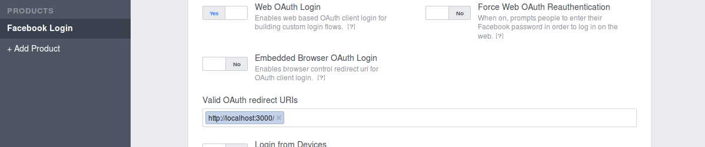
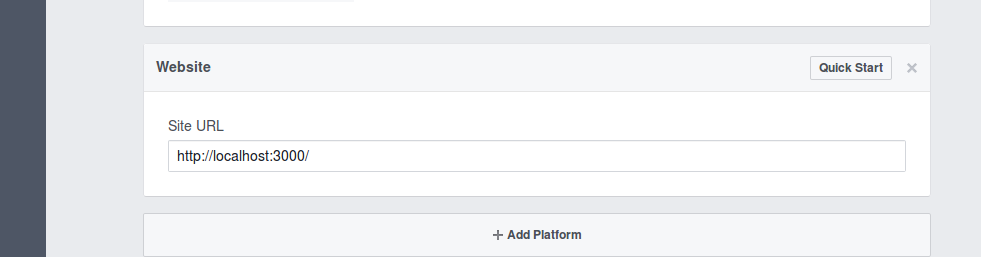

# facebook-twitter-authentication-hapi-jwt (WIP)
Basic authentication using Bell and jwt with Facebook and Twitter

##### Create the following file:

Create new json file called ```development.json``` in ```config``` folder and paste this code below (make sure this file is in .gitignore):

```json
{
	"host": "http://localhost:3000",
	"secret": "catscanfly",
	"fb": {
		"clientID": "<Facebook client id>",
		"clientSecret": "<Facebook client secret>",
	}
}

```

##### Create new app in Facebook

First create your app in the [Facebook Developer Platform](http://developers.facebook.com)
 - make sure you add valid auth redirect callback, like so (Facebook Login tab)
 
 - make sure you add platform with your domain address, in development as (Settings/Basic tab):
 

Copy clientID and clientSecret from Dashboard Tab and paste to your ```development.json```

##### Install redis database (we store jwt in there)
